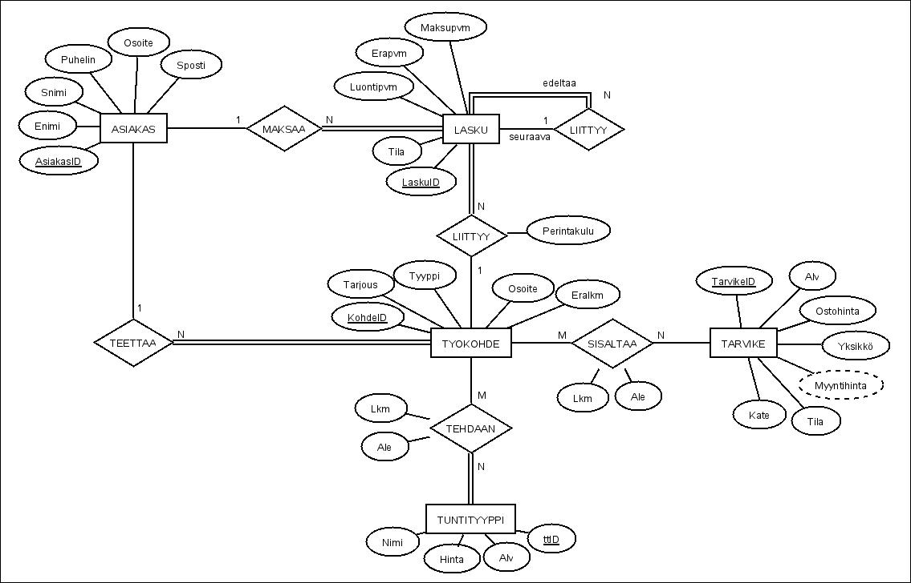
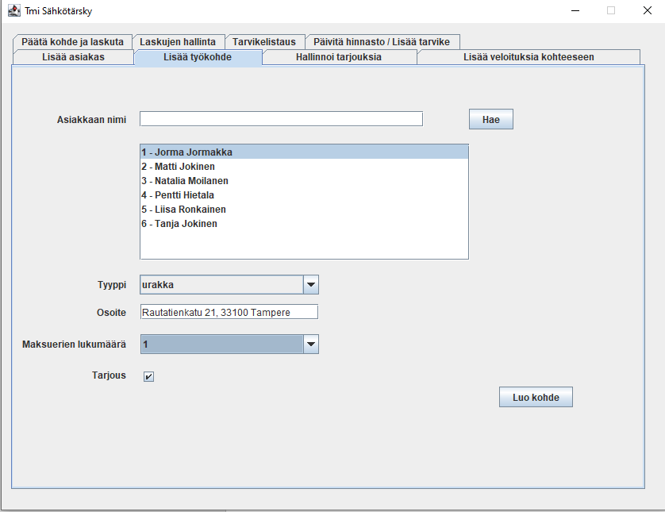
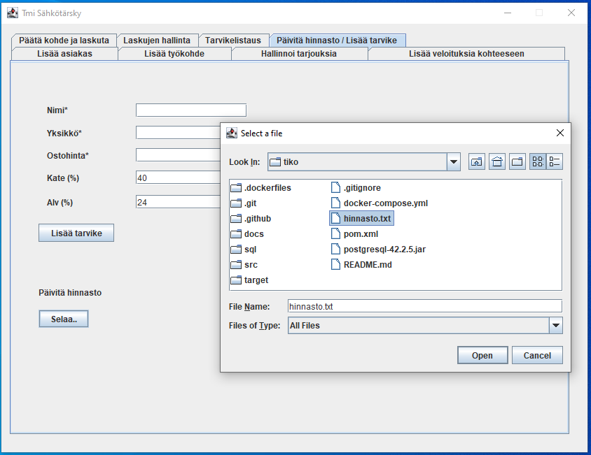

# Tietokantaohjelmointi 2020 harjoitustyö

Kolmen hengen ryhmässä tehty harjoitustyö Tampereen Yliopiston Tietokantaohjelmointi kurssilla.

## Tehtävänanto

Tmi Sähkötärsky on Seppo Tärskyn toiminimi, jonka nimissä hän suorittaa sähkötöitä sekä välittää
asentamiaan sähkötarvikkeita. Seppo tunnetaan kylällä mukavana ja ahkerana miehenä, mutta
laskutuksessa on ollut ongelmia. Laskujen lähetys usein viivästyy eikä laskuissa ole aina eritelty
kotitalousvähennykseen kelpaavaa osuutta.
Kotitalousvähennyksen osalta laskussa on ilmoitettava kotitalousvähennykseen kelpaava osuus.
Käytännössä tämä tarkoittaa työn osuutta laskusta. Lisätietoa kotitalousvähennyksestä osoitteessa
https://www.vero.fi/fi-FI/Henkiloasiakkaat/Kotitalousvahennys
Tehtävänä on suunnitella ja toteuttaa tietokanta, joka mahdollistaa laskujen kokoamisen ja sekä alla
kuvatun toiminnallisuuden.

[Koko tehtävänanto](https://github.com/anttipessa/tiko/blob/master/docs/Tiko%202020_ht.pdf)

## Tekijät

- Antti Pessa
- Henri Hakkarainen [@henrihakkarainen](https://www.github.com/henrihakkarainen)
- Risto Meltaus [@rmel770](https://www.github.com/rmel770)

## Tietokanta


[Luontilauseet](https://github.com/anttipessa/tiko/blob/master/sql/luontilauseet.sql)
## Toteutus

Toteutimme ohjelman Javalla ja teimme käyttöliittymän Swing käyttöliittymäkirjastolla. Ohjelma
jakautuu kolmeen tiedostoon Tiko2020, GUI ja DBManager, missä tehdään kaikki tietokantakyselyt.
Tiko2020 on pääluokka, josta ohjelma käynnistyy.

</br>
Lisää työkohde näkymä


Tarvikkeen lisäys tekstitiedostosta

## Dokumentaatio

Tarkemmin tietokannasta, toteutuksesta ja ohjelman ominaisuuksista:
[Dokumentti](https://github.com/anttipessa/tiko/blob/master/docs/tiko_dokumentti.pdf)

## Docker-ympäristön pystyttäminen
Projektin juurikansiossa suoritetaan komento:

`docker-compose up -d`

Tämä pystyttää kontin ja käynnistää palvelut (PostgreSQL-tietokanta + adminer web-käyttöliittymätyökalu)

Komennolla `docker-compose logs -f` voi katsoa kontissa tapahtuvia lokeja. Lokinäkymästä pääsee takaisin painamalla `Ctrl + C`.

Kun kontti on pystyssä, pääset sisällä olevaan Postgres-tietokantaan antamalla seuraavan komennon:

`docker exec -it tiko_db_1 psql -U tiko -W tiko_ht`

Ohjelma pyytää salasanaa johon kirjoitetaan `t1k0` ja painetaan Enter.

Nyt olet sisällä PostgreSQL tietokannassa ja voit antaa SQL-lauseita normaalisti. Listaa esim. tietokannassa olevat taulut komennolla `\dt`

Kun haluat lopettaa, poistu kontin sisältä komennolla `exit`

Lopuksi sammutetaan ajossa olevat kontit komennolla:

`docker-compose down`

<hr>

Vaihtoehtoisesti voit navigoida selaimella osoitteeseen: `http://localhost:8080` josta löytyy Adminer-työkalu.

Sisäänkirjautuminen tapahtuu seuraavilla tiedoilla:

```
Järjestelmä: PostgreSQL
Palvelin: db
Käyttäjänimi: tiko
Salasana: t1k0
Tietokanta: tiko_ht
```

## Docker-tiedostot

### .dockerfiles/db

Tietokantaympäristön määritykset.

### .dockerfiles/init_db.sql

Tietokannan alustuksessa käytettävät SQL-komennot. Luodaan tarvittavat taulut ja lisätään hieman rivejä jokaiseen tauluun. Tänne voi laittaa lisää INSERT-lauseita jos haluaa, että tietokannassa on heti alussa enemmän tavaraa.

### docker-compose.yml

Tässä tiedostossa määritetään Dockerin käyttämät palvelut, verkot ja voluumit.

Palvelut:
- db
  - Avaa PostgreSQL-tietokannan ja ohjaa sen porttiin 5432.
- adminer
  - Avaa adminer-webkäyttöliittymätyökalun porttiin 8080.
  
## Asennusohjeet

1. Asenna Maven https://maven.apache.org/ ja Java 11 https://www.oracle.com/java/technologies/javase-jdk11-downloads.html
2. Käynnistä PostgreSQL-tietokanta Dockerissa
3. DBManager.java tiedostossa seuraavat vakiot pitää asettaa vastaamaan oman PostgreSQL-tietokannan speksejä:
```
private static final String PROTOKOLLA = "jdbc:postgresql:";
private static final String PALVELIN = "localhost";
private static final int PORTTI = 5432; // default portti on 5432
private static final String TIETOKANTA = "tiko_ht"; // tähän tietokannan nimi
private static final String KAYTTAJA = "tiko"; // tähän tietokannan käyttäjä
private static final String SALASANA = "t1k0"; // tähän tietokantakäyttäjän salasana
```
4. Projektin juuressa kirjoita komentoriviin
```
mvn clean compile exec:java
```
